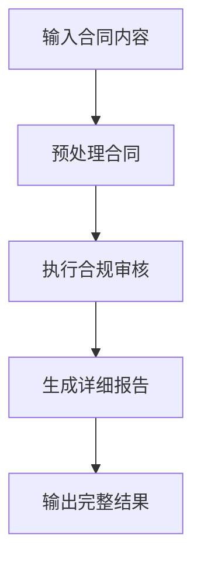

# 合同审核工作流使用指南

## 概述

合同审核工作流 (`contract-audit-workflow`) 是一个完整的企业合同合规性审核流程，通过多个步骤系统性地分析合同内容，生成专业的审核报告和行动建议。

## 🔄 工作流程概览



## 📋 工作流步骤详解

### 步骤1：预处理合同 (`preprocess-contract`)

**功能**：
- 验证和清理合同内容
- 检测合同语言（中文/英文）
- 生成合同唯一标识
- 分析内容基本特征

**输入**：
- `contractContent`: 原始合同文本
- `contractType`: 合同类型
- `contractId`: 合同编号（可选）
- `companyName`: 公司名称（可选）

**输出**：
- `processedContent`: 处理后的合同内容
- `contentLength`: 内容长度
- `detectedLanguage`: 检测到的语言
- `hasStandardClauses`: 是否包含标准条款

### 步骤2：执行合规审核 (`perform-audit`)

**功能**：
- 调用合同审核工具进行全面检查
- 评估各项合规指标
- 计算合规评分和风险等级

**输入**：预处理结果

**输出**：
- 完整的审核结果对象
- 包含所有合规检查项目
- 风险评估和建议

### 步骤3：生成详细报告 (`generate-report`)

**功能**：
- 生成专业的审核报告
- 创建执行摘要
- 制定具体行动计划

**输入**：审核结果

**输出**：
- `detailedReport`: 详细审核报告
- `executiveSummary`: 执行摘要
- `actionItems`: 行动项目清单

## 💻 使用方法

### 基础用法

```typescript
import { mastra } from './src/mastra';

// 执行合同审核工作流
const result = await mastra.runWorkflow('contract-audit-workflow', {
  contractContent: `
    数据可视化服务合同
    
    甲方：XX科技有限公司
    乙方：YY信息技术有限公司
    
    一、服务内容
    乙方为甲方提供企业数据可视化大屏开发服务...
    
    二、数据处理
    双方承诺严格保护数据安全...
  `,
  contractType: 'visualization_dashboard',
  contractId: 'VD-2024-001',
  companyName: 'XX科技有限公司'
});

console.log('审核完成:', result);
```

### 高级用法 - 批量审核

```typescript
const contracts = [
  {
    content: '合同内容1...',
    type: 'visualization_dashboard',
    id: 'VD-001'
  },
  {
    content: '合同内容2...',
    type: 'software_license',
    id: 'SL-001'
  }
];

const results = await Promise.all(
  contracts.map(contract => 
    mastra.runWorkflow('contract-audit-workflow', {
      contractContent: contract.content,
      contractType: contract.type,
      contractId: contract.id
    })
  )
);

console.log('批量审核完成:', results);
```

## 📊 输出结果结构

### 完整输出

```typescript
interface WorkflowResult {
  auditResult: {
    contractId: string;
    contractType: string;
    overallRiskLevel: 'low' | 'medium' | 'high' | 'critical';
    complianceScore: number; // 0-100
    complianceChecks: ComplianceCheck[];
    summary: string;
    criticalIssues: string[];
    recommendations: string[];
    auditTimestamp: string;
  };
  detailedReport: string;      // Markdown格式的详细报告
  executiveSummary: string;    // 简洁的执行摘要
  actionItems: ActionItem[];   // 具体行动项目
}
```

### 行动项目结构

```typescript
interface ActionItem {
  priority: 'high' | 'medium' | 'low';
  category: string;           // 如：数据安全、知识产权
  action: string;            // 具体行动描述
  deadline?: string;         // 建议完成时间
}
```

## 📈 报告示例

### 详细报告格式

```markdown
# 合同合规审核报告

## 📋 基本信息
- 合同编号：VD-2024-001
- 合同类型：可视化大屏
- 审核时间：2024-01-15T10:30:00.000Z
- 合规评分：75/100
- 风险等级：中等风险

## 📊 审核概要
可视化大屏合同合规审核完成。合规得分：75分，风险等级：中等风险。
合同存在一些合规问题，建议优化。

## 🔍 详细检查结果

### ✅ 合规项目
- 数据安全：数据保护条款 ✅
- 服务等级：SLA条款 ✅

### ❌ 不合规项目
- 知识产权：知识产权归属 ❌
  建议：明确可视化大屏的知识产权归属，包括数据、设计和代码的所有权

## 🚨 关键风险点
- 知识产权: 知识产权归属

## 💡 改进建议
1. 明确可视化大屏的知识产权归属，包括数据、设计和代码的所有权
2. 建议添加数据刷新频率和实时性要求的具体条款
3. 明确可视化效果的验收标准和测试方法
```

### 行动项目示例

```json
[
  {
    "priority": "high",
    "category": "知识产权",
    "action": "立即处理: 知识产权: 知识产权归属",
    "deadline": "7天内"
  },
  {
    "priority": "medium", 
    "category": "技术规范",
    "action": "添加技术标准要求，包括接口规范、数据格式、显示标准等技术细节",
    "deadline": "30天内"
  }
]
```

## 🎯 最佳实践

### 1. 输入准备
- 确保合同内容完整且格式清晰
- 选择正确的合同类型以获得最准确的审核
- 提供合同ID便于追踪和管理

### 2. 结果分析
- 优先关注高优先级行动项目
- 重点解决关键风险点
- 定期跟踪改进进度

### 3. 工作流集成
- 可与其他业务系统集成
- 支持自动化批量处理
- 便于建立合同审核标准流程

## ⚠️ 注意事项

1. **数据隐私**：确保敏感合同信息的安全处理
2. **法律效力**：工作流结果仅供参考，重要决策需咨询专业律师
3. **定期更新**：随着法规变化及时更新审核标准
4. **性能考虑**：大型合同可能需要更多处理时间

## 🔧 错误处理

工作流包含完善的错误处理机制：

- 内容长度验证（最少100字符）
- 合同类型验证
- 工具和代理可用性检查
- 详细的错误日志记录

## 📞 技术支持

如需帮助或发现问题，请：
1. 检查输入数据格式是否正确
2. 确认环境变量配置完整
3. 查看日志获取详细错误信息
4. 联系技术团队获取支持